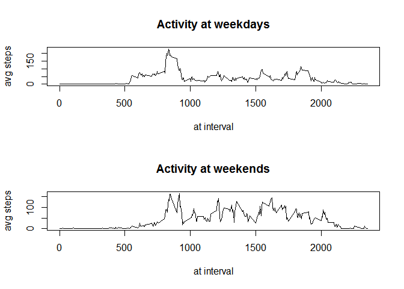

# Reproducible Research: Peer Assessment 1


## Loading and preprocessing the data

```r
con <- unz ( "activity.zip" , "activity.csv")
activdata<-read.csv( con  )
summary(activdata)
```

```
##      steps                date          interval     
##  Min.   :  0.00   2012-10-01:  288   Min.   :   0.0  
##  1st Qu.:  0.00   2012-10-02:  288   1st Qu.: 588.8  
##  Median :  0.00   2012-10-03:  288   Median :1177.5  
##  Mean   : 37.38   2012-10-04:  288   Mean   :1177.5  
##  3rd Qu.: 12.00   2012-10-05:  288   3rd Qu.:1766.2  
##  Max.   :806.00   2012-10-06:  288   Max.   :2355.0  
##  NA's   :2304     (Other)   :15840
```


## What is mean total number of steps taken per day?
1. Calculate total steps per day  

```r
total_steps_perday<-sapply(split(activdata$steps, activdata$date) ,sum ,na.rm=TRUE)
```

2. Make a histogram of the total number of steps taken each day  

```r
hist ( total_steps_perday )
```


3. Calculate mean steps taken each day  

```r
mean_steps_perday <- mean (total_steps_perday)
print(mean_steps_perday)
```

```
## [1] 9354.23
```

4. Calculate median steps taken each day  

```r
med_steps_perday <- median (total_steps_perday)
print (med_steps_perday)
```

```
## [1] 10395
```

## What is the average daily activity pattern?

1. Calculate average steps at each interval

```r
avg_steps_at_interval <- sapply ( split (activdata$steps, activdata$interval), mean, na.rm = TRUE)
```

2. Make a time series plot of the 5-minute interval (x-axis) and the average number of steps taken, averaged across all days (y-axis)

```r
plot ( names(avg_steps_at_interval), avg_steps_at_interval, type="l", xlab="at interval", ylab="avg steps")
```


   Find the 5-minute interval, which on average across all the days in the dataset, contains the maximum number of steps:

```r
avg_ints <-  as.data.frame ( cbind (interval = (names(avg_steps_at_interval)) , avg_steps_at_interval = as.data.frame(avg_steps_at_interval) , stringsAsFactors=FALSE ) )
a<-avg_ints$interval[avg_ints$avg_steps_at_interval == max (avg_ints$avg_steps_at_interval)]
print(a)
```

```
## [1] "835"
```

## Imputing missing values
1. Calculate and report the total number of missing values in the dataset

```r
s<- summary( as.factor (activdata$steps ))
na_vals <- s["NA's"]
print ( na_vals )
```

```
## NA's 
## 2304
```

2. Get the mean values for the given interval to replace missing values

```r
avg_ints <-  as.data.frame ( cbind (interval = (names(avg_steps_at_interval)) , avg_steps_at_interval = as.data.frame(avg_steps_at_interval) ) )
head(avg_ints)
```

```
##    interval avg_steps_at_interval
## 0         0             1.7169811
## 5         5             0.3396226
## 10       10             0.1320755
## 15       15             0.1509434
## 20       20             0.0754717
## 25       25             2.0943396
```

3. Create a new dataset that is equal to the original dataset but with the missing data filled in.

```r
missing_values <- is.na ( activdata$steps)
intervals_w_missing_vals <- activdata$interval[missing_values]
activdata_imp <- activdata
activdata_imp$steps[missing_values] <- avg_ints$avg_steps_at_interval [match ( intervals_w_missing_vals, avg_ints$interval )]
head(activdata)
```

```
##   steps       date interval
## 1    NA 2012-10-01        0
## 2    NA 2012-10-01        5
## 3    NA 2012-10-01       10
## 4    NA 2012-10-01       15
## 5    NA 2012-10-01       20
## 6    NA 2012-10-01       25
```

```r
head(activdata_imp)
```

```
##       steps       date interval
## 1 1.7169811 2012-10-01        0
## 2 0.3396226 2012-10-01        5
## 3 0.1320755 2012-10-01       10
## 4 0.1509434 2012-10-01       15
## 5 0.0754717 2012-10-01       20
## 6 2.0943396 2012-10-01       25
```

4. Make a histogram of the total number of steps taken each day using imputed data set

```r
total_steps_perday_imp<-sapply(split(activdata_imp$steps, activdata_imp$date) ,sum ,na.rm=TRUE)
hist ( total_steps_perday_imp )
```


Calculate and report the mean and median

```r
mean_steps_perday_imp <- mean (total_steps_perday_imp)
print(mean_steps_perday_imp)
```

```
## [1] 10766.19
```

```r
med_steps_perday_imp <- median (total_steps_perday_imp)
print (med_steps_perday_imp)
```

```
## [1] 10766.19
```

Original mean was:

```
## [1] 9354.23
```

Original median was:

```
## [1] 10395
```

## Are there differences in activity patterns between weekdays and weekends?

```r
activdata_imp <- transform ( activdata_imp, date = as.Date (activdata_imp$date))
w <- ifelse (weekdays(activdata_imp$date) %in% c('Sunday','Saturday') , 'weekend', 'weekday' )
activdata_imp$w <- w
avg_steps_imp_weekend <- sapply ( split (activdata_imp$steps[activdata_imp$w=='weekend'], activdata_imp$interval[activdata_imp$w=='weekend']), mean, na.rm = TRUE)
avg_steps_imp_weekdays <- sapply ( split (activdata_imp$steps[activdata_imp$w=='weekday'], activdata_imp$interval[activdata_imp$w=='weekday']), mean, na.rm = TRUE)

par(mfrow=c(2,1))
plot ( names(avg_steps_at_interval), avg_steps_imp_weekdays, type="l", xlab="at interval", ylab="avg steps", main='Activity at weekdays')
plot ( names(avg_steps_at_interval), avg_steps_imp_weekend, type="l", xlab="at interval", ylab="avg steps", main='Activity at weekends')
```


